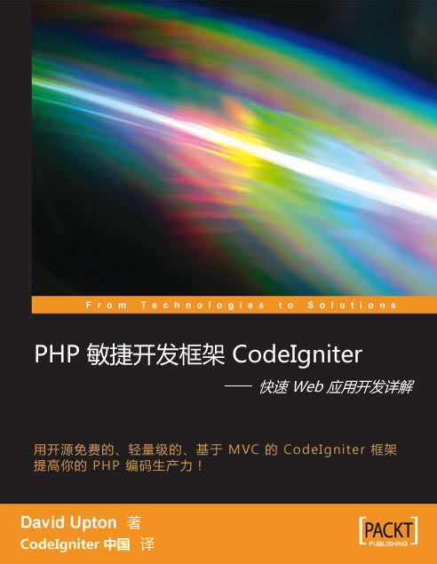

《CodeIgniter for Rapid PHP Application Development》中文版
=================================

简介
---------------------------------
**中文名**：《PHP 敏捷开发框架 CodeIgniter - 快速 Web 应用开发详解》

我们要特别感谢 [李嵩波](http://weibo.com/songboli)(原新浪CTO) 先生在百忙之中为本书作序，也要感谢 PHPChina 社区的 chenz1117 对于翻译工作所作出的巨大贡献，还包括 [沧蓝](http://fredwu.me/) 等朋友对翻译技术上的问题所给予的巨大帮助，还包括许多为本书做过贡献的朋友，在这里就不一一列举了，书中有详细的制作者名单，让我们再次对他们表示衷心的感谢！

本书是第一本详细介绍 CodeIgniter 框架的著作（目前已经有了另外几本介绍 CI 的著作了），下面是本书的一个简短介绍：

> 本书详细讲解了 CI 的一些主要特性。本书并不包含 CI 的所有内容和全部细节。CI 有一本出色的在线《用户指南》，它详细讲解了大多数的内容。它可以与 CI 一起下载。

> 本书并不想重复《用户指南》中的内容。相反，本书试图让你轻松了解 CI 框架是如何工作的，那么，你可以先决定它是否对你有价值，然后再阅读本书。

> 在试图解释 CI 是如何工作时，本书的某些内容已经超出了《用户指南》的范围。（《用户指南》更注重实际应用。）这意味着在“实战训练”中有一些非常理论化的章节。我发现这有助于理解 CI 内部的运行机制；否则，当你遇到令人费解的错误消息时就不容易解决。

> 我尝试在展示 CI 代码段时使用一个“真实世界”的例子。我想展示的是，CI 可以用于开发一个正式的网站。目前，我手头上有几个正在运行的客户网站，我希望依照我指定的方式去对其进行检测控制以及测试，同时记录下程序操作行为，在我需要时我可以得到一份相关的报告。

> 本书中的范例无法将 CI 的功能一丝不漏的完全展示，但我想这些范例应当还是在一定程度上展现了 CI 在简化处理常用应用（以及一些非常用应用）上的能力。

> 本书系统地讲解了 CodeIgniter 的主要特性，并配合相应的代码范例进行了详尽的解释，使你能够由浅入深地掌握 CodeIgniter。

最后，感谢社区所有朋友的大力支持与关心！

相关链接: http://codeigniter.org.cn/forums/thread-1464-1-1.html

编译方法
---------------------------------
目前只支持 Windows 平台的编译。

需要用到的工具：
* HTML Help Workshop 下载: http://www.microsoft.com/en-us/download/details.aspx?id=21138

把 hhc.exe 加入到 PATH 环境变量中，然后执行 build.bat，即可生成 CodeIgniter.chm 文件。
